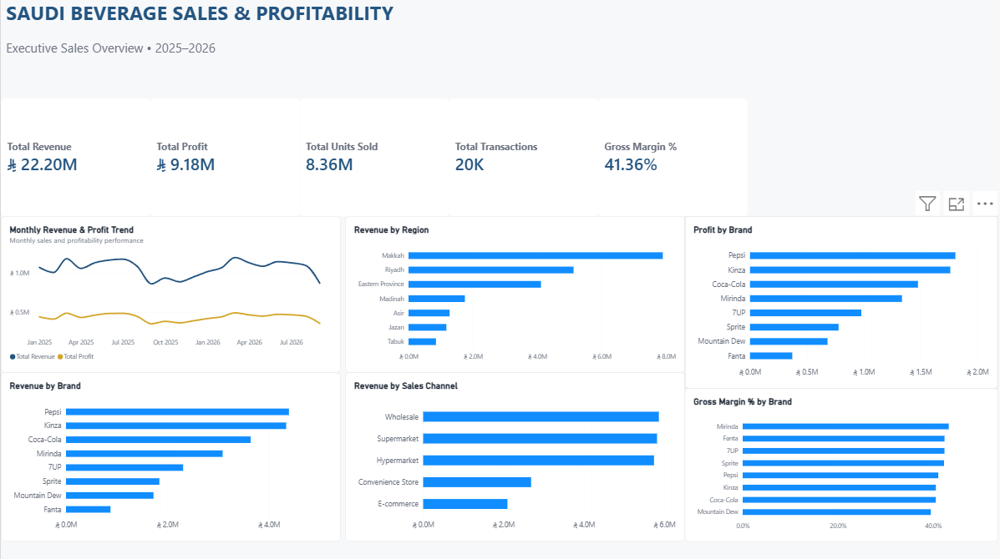

# Saudi Beverage Sales Analytics

## Executive Sales & Profitability Dashboard

A business intelligence and data analytics project analyzing synthetic beverage sales data across Saudi Arabia for 2025–2026.

The project combines Python-based exploratory data analysis with Microsoft Power BI to analyze revenue, profitability, sales channels, regional performance, brand performance, and gross margins.

> **Dataset note:** The dataset used in this project is synthetic and created for portfolio/learning purposes. It does not represent actual company sales data.

---

## Business Objectives

The analysis focuses on answering key business questions:

- How is revenue and profit performing over time?
- Which Saudi regions generate the highest revenue?
- Which beverage brands contribute the most revenue and profit?
- Which sales channels generate the most revenue?
- Which brands have the strongest gross margins?
- Where are the major differences between revenue and profitability?

---

## Key Performance Indicators

| KPI           |     Result |
| ------------- | ---------: |
| Total Revenue | SAR 22.20M |
| Total Profit  |  SAR 9.18M |
| Units Sold    |      8.36M |
| Transactions  |        20K |
| Gross Margin  |     41.36% |

---

## Dashboard

The Power BI executive dashboard includes:

- Monthly Revenue & Profit Trend
- Revenue by Region
- Revenue by Brand
- Revenue by Sales Channel
- Profit by Brand
- Gross Margin % by Brand
- Executive KPI cards

### Dashboard Preview



---

## Tools & Technologies

- **Python**
  - Pandas
  - Matplotlib
  - Jupyter Notebook
- **Microsoft Power BI Desktop**
- **Power Query**
- **DAX**
- **Excel**
- **Git & GitHub**

---

## Project Structure

```text
05-Saudi-Beverage-Sales-Analytics/
│
├── dashboard/
│   └── screenshots/
│       └── executive_sales_dashboard.png
│
├── data/
│   ├── raw/
│   └── cleaned/
│       └── Saudi_Beverage_Sales_Cleaned.csv
│
├── documentation/
│
├── powerbi/
│   └── Saudi_Beverage_Sales_Analytics.pbix
│
├── python/
│   └── 01_beverage_eda.ipynb
│
├── sql/
│
├── .gitignore
└── README.md
```
